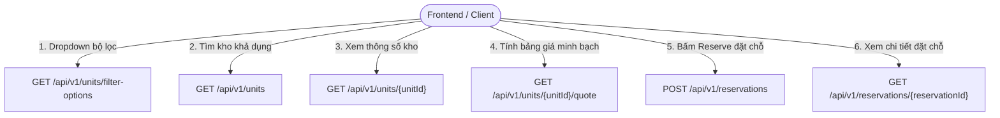
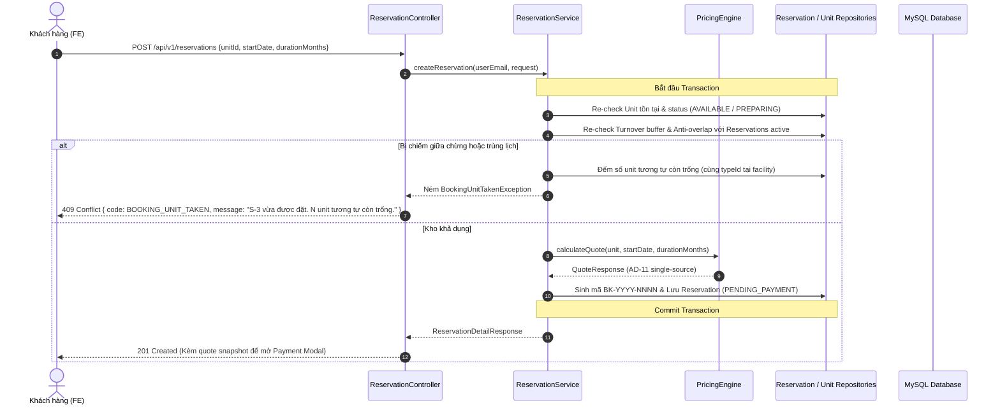

# Hướng Dẫn Chi Tiết Triển Khai Backend: Browse Units, Unit Detail & Booking Reserve

> **Người thực hiện:** Kỹ sư Backend StorageHub (Phúc)  
> **Phạm vi hoàn thiện:** Sprint 1 — Feature 4.2 / User Stories:  
> - **US-6:** Browse Units với Availability chính xác (FR-4)  
> - **US-7:** Unit Detail & Bảng giá minh bạch (FR-6, AD-11)  
> - **US-9:** Booking Summary & Reserve re-check chống Stale data (FR-5, FR-7)  
> **Nguồn đối chiếu:** `contracts/openapi.yaml`, `docs/architecture/ARCHITECTURE-SPINE.md`, `docs/prd/prd.md`, `docs/ux/DESIGN.md`, `docs/ux/EXPERIENCE.md`, Mockups `F1-03-browse-units.html`, `F1-04-unit-detail.html`, `F1-05-booking-summary.html`  
> **Branch Git:** `be/phuc`  
> **Trạng thái:** Đã hoàn thành 100% code backend & bộ test suite (**28/28 test cases passed**).

---

## 1. Bản Chất Nghiệp Vụ & Quy Tắc Bất Biến (Architecture Invariants)

Toàn bộ mã nguồn backend tuân thủ nghiêm ngặt các nguyên tắc kiến trúc đã đóng băng trong `ARCHITECTURE-SPINE.md`:

```
+-----------------------------------------------------------------------------------+
|                            ARCHITECTURE INVARIANTS                                |
+-----------------------------------------------------------------------------------+
|  AD-2: Contract-First API     -> 100% wire format, path, query param từ openapi. |
|  AD-3: Layer-First            -> Controller -> Service -> Repository (DTOs only). |
|  AD-4: Server Exclusive Time  -> AVAILABLE_SOON & EXPIRED là derived state on-read|
|  AD-5: Auth Matrix            -> Yêu cầu Bearer token hợp lệ trên mọi endpoint.  |
|  AD-6: Data Ownership         -> UnitService làm chủ units; ReservationService    |
|                                  làm chủ reservations (trọn vòng đời đặt & thuê).|
|  AD-7: Money & Time Format    -> Tiền VND nguyên (Long), ngày YYYY-MM-DD (ICT).   |
|  AD-8: Envelope Thống Nhất    -> UnitPage / ReservationPage / ApiError chuẩn hóa. |
|  AD-11: Pricing Single-Source -> PricingEngine là nguồn DUY NHẤT của mọi dòng tiền|
+-----------------------------------------------------------------------------------+
```

### Các nguyên tắc nghiệp vụ cốt lõi:
1. **AD-2 (Contract-First API):** 
   - `contracts/openapi.yaml` là chân lý duy nhất. Mọi URL, HTTP method, query parameter kebab-case (`type-id`, `size-m2`, `start-date`, `duration-months`), JSON key camelCase (`baseMonthlyRent`, `availableFromDate`, `depositAmount`, `totalRent`), Enum value, Error envelope phải chính xác từng ký tự.
2. **AD-3 (Layer-First Discipline):**
   - `Controller` chỉ nhận HTTP, validate param, gọi Service, trả `ResponseEntity<DTO>`.
   - `Entity` JPA không bao giờ được lọt ra ngoài Controller.
3. **AD-4 (Backend Độc Quyền State & Thời Gian):**
   - Trạng thái `AVAILABLE_SOON` (do đệm dọn dẹp Turnover Buffer) và `EXPIRED` (do quá hạn nhận kho mà không check-in) là **trạng thái tính toán on-read (derived state)**.
   - **TUYỆT ĐỐI CẤM** persist `AVAILABLE_SOON` hay `EXPIRED` trực tiếp vào cột `status` trong database.
4. **AD-6 (Data Ownership & Concurrency Guard):**
   - `UnitService` sở hữu catalog kho.
   - `ReservationService` độc quyền ghi và quản lý toàn bộ vòng đời đặt chỗ (`reservations`).
   - Chống double-booking (FR-5): Reserve chạy trong `@Transactional` kiểm tra xung đột lịch đặt. Cột `lock_version` (`@Version`) trên `units` bảo vệ chống race-condition đồng thời.
5. **AD-11 (Pricing Single-Source - Bảng Giá Minh Bạch):**
   - Mọi số liệu tài chính hiển thị tại **Unit Detail**, **Booking Summary**, **Payment Modal** và **Hợp đồng điện tử** đều bắt buộc phải được tính toán từ một nguồn duy nhất: `PricingEngine`.
   - Không dòng tiền nào xuất hiện ở bước thanh toán mà vắng mặt ở Booking Summary.

---

## 2. Danh Sách 6 Endpoints Hoàn Thiện



### 2.1. `GET /api/v1/units/filter-options`
- Cung cấp danh mục loại kho và danh sách kích thước m² có sẵn.
- **Response `200 OK`:**
```json
{
  "types": [
    { "id": 1, "name": "Locker" },
    { "id": 2, "name": "S" },
    { "id": 3, "name": "M" },
    { "id": 4, "name": "L" }
  ],
  "sizesM2": [1.5, 5.0, 8.0, 15.0]
}
```

### 2.2. `GET /api/v1/units`
- Tìm kiếm kho với availability tính động (turnover buffer, anti-overlap conflict check), phân trang 1-based.
- **Response `200 OK` (`UnitPage`):**
```json
{
  "items": [
    {
      "id": 1,
      "code": "S-1",
      "typeName": "S",
      "sizeM2": 5.0,
      "floor": 1,
      "zoneCode": "A",
      "facilityName": "Tân Bình Depot",
      "accessType": "PIN",
      "baseMonthlyRent": 345000,
      "availability": {
        "status": "AVAILABLE",
        "availableFromDate": null
      },
      "photoUrl": "/units/S-1.jpg"
    }
  ],
  "page": 1,
  "pageSize": 25,
  "total": 1
}
```

### 2.3. `GET /api/v1/units/{unitId}`
- Trả về thông số chi tiết đầy đủ (spec) của 1 kho.
- **Response `200 OK` (`UnitDetail`):**
```json
{
  "id": 3,
  "code": "S-3",
  "typeName": "S",
  "sizeM2": 5.0,
  "floor": 1,
  "zoneCode": "A",
  "facilityName": "Tân Bình Depot",
  "accessType": "PIN",
  "baseMonthlyRent": 345000,
  "availability": {
    "status": "AVAILABLE",
    "availableFromDate": null
  },
  "photoUrl": "/units/S-3.jpg",
  "dimensions": "2.0 × 2.5 × 2.2 m",
  "security": "24/7 PIN + CCTV + Motion sensors",
  "photoUrls": [
    "/units/S-3.jpg",
    "/units/S-3-interior.jpg"
  ]
}
```

### 2.4. `GET /api/v1/units/{unitId}/quote`
- Bảng giá minh bạch tính từ `PricingEngine` (AD-11) làm nền cho màn Booking Summary.
- **Query Params:** `start-date` (YYYY-MM-DD), `duration-months` (1..36).
- **Response `200 OK` (`Quote`):**
```json
{
  "unitId": 3,
  "startDate": "2026-10-03",
  "endDate": "2027-01-02",
  "durationMonths": 3,
  "lines": [
    {
      "kind": "RENT",
      "code": "RENT_RATE",
      "label": "Rent 345.000 ₫ × 3 months",
      "amount": 1035000,
      "refundable": false
    },
    {
      "kind": "DEPOSIT",
      "code": "DEPOSIT_RATE",
      "label": "Deposit (10%, refundable)",
      "amount": 103500,
      "refundable": true
    }
  ],
  "totalRent": 1035000,
  "depositAmount": 103500,
  "dueNow": 103500,
  "policyVersion": "v3"
}
```

### 2.5. `POST /api/v1/reservations` (Reserve Re-check - FR-5)
- Re-check availability trong Transaction: Nếu kho bị chiếm giữa chừng -> **HTTP 409 Conflict** (`BOOKING_UNIT_TAKEN`). Nếu còn trống -> tạo đơn ở trạng thái `PENDING_PAYMENT` và snapshot bảng giá.
- **Request Body:**
```json
{
  "unitId": 3,
  "startDate": "2026-10-03",
  "durationMonths": 3
}
```
- **Response `201 Created` (`ReservationDetail`):**
```json
{
  "id": 1042,
  "code": "BK-2026-0001",
  "status": "PENDING_PAYMENT",
  "unit": {
    "code": "S-3",
    "sizeM2": 5.0,
    "typeName": "S"
  },
  "startDate": "2026-10-03",
  "endDate": "2027-01-02",
  "depositAmount": 103500,
  "depositStatus": null,
  "durationMonths": 3,
  "quote": {
    "unitId": 3,
    "startDate": "2026-10-03",
    "endDate": "2027-01-02",
    "durationMonths": 3,
    "lines": [
      { "kind": "RENT", "code": "RENT_RATE", "label": "Rent 345.000 ₫ × 3 months", "amount": 1035000, "refundable": false },
      { "kind": "DEPOSIT", "code": "DEPOSIT_RATE", "label": "Deposit (10%, refundable)", "amount": 103500, "refundable": true }
    ],
    "totalRent": 1035000,
    "depositAmount": 103500,
    "dueNow": 103500,
    "policyVersion": "v3"
  },
  "checkInDeadline": "2026-10-03",
  "depositForfeitReason": null,
  "accessCode": null,
  "payments": [],
  "contracts": []
}
```
- **Error Response `409 Conflict` (khi kho vừa bị người khác đặt):**
```json
{
  "code": "BOOKING_UNIT_TAKEN",
  "message": "S-3 vừa được đặt. 5 unit tương tự còn trống.",
  "fieldErrors": []
}
```

### 2.6. `GET /api/v1/reservations/{reservationId}`
- Chi tiết hồ sơ đặt chỗ/thuê kho (Rental Detail), hỗ trợ suy diễn `EXPIRED` on-read nếu quá ngày nhận kho mà chưa check-in (FR-36, AD-4).
- **Response `200 OK` (`ReservationDetail`)**

---

## 3. Kiến Trúc Thuật Toán & Xử Lý Concurrency (FR-5, FR-7)



### Thuật toán Re-check Availability khi Reserve (FR-5):
1. **Kiểm tra trạng thái vật lý:** `unit.status` phải là `AVAILABLE` hoặc `PREPARING`. Nếu là `RENTED`, `MAINTENANCE`, `RETIRED` -> Đánh dấu bị chiếm.
2. **Kiểm tra Turnover Buffer:** Nếu `unit.status == PREPARING`, tính ngày dọn xong `readyDate = latestClosedRes.endDate + bufferDays`. Nếu `startDate < readyDate` -> Đánh dấu bị chiếm.
3. **Kiểm tra Anti-Overlap:** Truy vấn các reservation đã giữ kho (`RESERVED`, `CHECKED_IN`, `CHECKOUT_REQUESTED`). Khoảng thời gian yêu cầu `[startDate, endDate + bufferDays]` không được giao nhau với bất kỳ reservation active nào.
4. **Đếm Unit tương tự khi bị chiếm:**
   - Tìm danh sách các kho cùng `typeId` trong cùng cơ sở có trạng thái `AVAILABLE` hoặc `PREPARING` và không bị trùng lịch.
   - Trả về thông báo thân thiện: `"{code} vừa được đặt. {count} unit tương tự còn trống."` hoặc `"{code} vừa được đặt. Không còn unit tương tự trống trong thời gian này."`.

---

## 4. Kết Quả Kiểm Thử Tự Động (Automated Testing)

Toàn bộ **28 test cases** đã vượt qua kiểm thử tự động với **100% BUILD SUCCESS**:

```
[INFO] -------------------------------------------------------
[INFO]  T E S T S
[INFO] -------------------------------------------------------
[INFO] Running com.storagehub.controller.ReservationControllerTest
[INFO] Tests run: 5, Failures: 0, Errors: 0, Skipped: 0, Time elapsed: 2.894 s -- in com.storagehub.controller.ReservationControllerTest
[INFO] Running com.storagehub.controller.UnitControllerTest
[INFO] Tests run: 6, Failures: 0, Errors: 0, Skipped: 0, Time elapsed: 0.556 s -- in com.storagehub.controller.UnitControllerTest
[INFO] Running com.storagehub.service.PricingEngineTest
[INFO] Tests run: 3, Failures: 0, Errors: 0, Skipped: 0, Time elapsed: 0.152 s -- in com.storagehub.service.PricingEngineTest
[INFO] Running com.storagehub.service.ReservationServiceTest
[INFO] Tests run: 6, Failures: 0, Errors: 0, Skipped: 0, Time elapsed: 0.249 s -- in com.storagehub.service.ReservationServiceTest
[INFO] Running com.storagehub.service.UnitServiceTest
[INFO] Tests run: 8, Failures: 0, Errors: 0, Skipped: 0, Time elapsed: 0.061 s -- in com.storagehub.service.UnitServiceTest
[INFO] 
[INFO] Results:
[INFO] 
[INFO] Tests run: 28, Failures: 0, Errors: 0, Skipped: 0
[INFO] 
[INFO] ------------------------------------------------------------------------
[INFO] BUILD SUCCESS
[INFO] ------------------------------------------------------------------------
```

### Các kịch bản kiểm thử mới cho Reservation:
1. **`ReservationServiceTest`:**
   - `testCreateReservation_Success`: Tạo reservation thành công với mã `BK-YYYY-NNNN`, trạng thái `PENDING_PAYMENT`, `quote` snapshot chính xác.
   - `testCreateReservation_UnitNotFound`: Ném `UnitNotFoundException` (404) khi `unitId` không tồn tại.
   - `testCreateReservation_UnitTaken_StatusRented`: Ném `BookingUnitTakenException` (409) kèm số lượng unit tương tự còn trống khi unit đã bị thuê.
   - `testCreateReservation_UnitTaken_OverlappingReservation`: Ném `BookingUnitTakenException` (409) khi khoảng thời gian bị trùng với reservation active.
   - `testGetReservationDetail_Success`: Đọc chi tiết reservation của chính chủ kèm bảng giá và trạng thái tiền cọc (`HELD`).
   - `testGetReservationDetail_NotOwner`: Chặn truy cập và ném ngoại lệ khi user không phải chủ đơn và không phải staff/admin.
2. **`ReservationControllerTest`:**
   - `testCreateReservation_Success`: `POST /api/v1/reservations` trả về **201 Created** cùng `ReservationDetailResponse`.
   - `testCreateReservation_Conflict_UnitTaken`: `POST /api/v1/reservations` trả về **409 Conflict** với mã lỗi `BOOKING_UNIT_TAKEN`.
   - `testCreateReservation_ValidationFailed`: `POST /api/v1/reservations` trả về **400 Bad Request** với mã lỗi `VALIDATION_FAILED` khi `durationMonths <= 0`.
   - `testGetReservationDetail_Success`: `GET /api/v1/reservations/{id}` trả về **200 OK**.
   - `testGetReservationDetail_NotFound`: `GET /api/v1/reservations/{id}` trả về **404 Not Found**.

---

## 5. Hướng Dẫn Kiểm Thử Thực Tế Bằng cURL

Khởi chạy backend:
```bash
cd backend
mvn spring-boot:run
```

### Bước 1: Đăng nhập lấy JWT Token
```bash
curl -X POST http://localhost:8080/api/v1/auth/login \
  -H "Content-Type: application/json" \
  -d '{"email":"<USER_EMAIL>","password":"<USER_PASSWORD>"}'
```

### Bước 2: Xem Bảng Giá Minh Bạch Trước Khi Đặt (Booking Summary)
```bash
curl -X GET "http://localhost:8080/api/v1/units/3/quote?start-date=2026-10-03&duration-months=3" \
  -H "Authorization: Bearer <TOKEN>"
```

### Bước 3: Bấm Reserve Tạo Đơn Đặt Chỗ (Reserve Re-check)
```bash
curl -X POST http://localhost:8080/api/v1/reservations \
  -H "Authorization: Bearer <TOKEN>" \
  -H "Content-Type: application/json" \
  -d '{"unitId": 3, "startDate": "2026-10-03", "durationMonths": 3}'
```
Kết quả trả về **201 Created** với `status: "PENDING_PAYMENT"`, mã `code: "BK-2026-0001"`, `depositAmount: 103500`.

### Bước 4: Thử Đặt Trùng Kho Đã Bị Chiếm (Kiểm thử 409 Conflict)
Khi unit đã được xác nhận đặt hoặc bị trùng lịch:
```bash
curl -X POST http://localhost:8080/api/v1/reservations \
  -H "Authorization: Bearer <TOKEN>" \
  -H "Content-Type: application/json" \
  -d '{"unitId": 3, "startDate": "2026-10-03", "durationMonths": 3}'
```
Kết quả trả về **409 Conflict**:
```json
{
  "code": "BOOKING_UNIT_TAKEN",
  "message": "S-3 vừa được đặt. 5 unit tương tự còn trống.",
  "fieldErrors": []
}
```
Client (FE) dựa vào mã này để hiển thị Toast thông báo và gợi ý người dùng chọn các unit tương tự.
