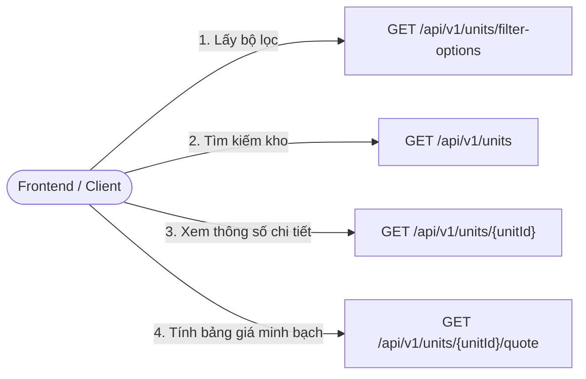
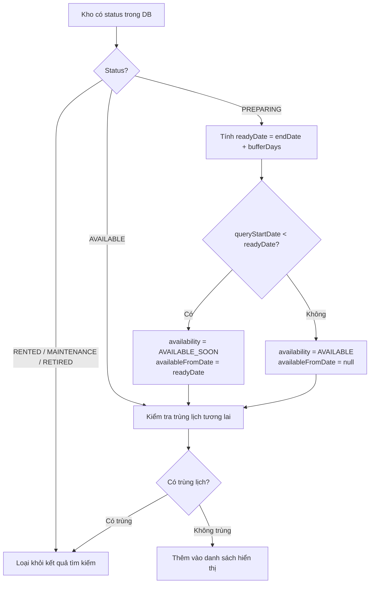

# Hướng Dẫn Chi Tiết Triển Khai Backend: Browse Units & Unit Detail (Bảng Giá Minh Bạch)

> **Người thực hiện:** Kỹ sư Backend StorageHub (Phúc)  
> **Phạm vi hoàn thiện:** Sprint 1 — Feature 4.2 / User Story **US-6** (FR-4, FR-5) và **US-7** (FR-6, AD-11)  
> **Nguồn đối chiếu:** `contracts/openapi.yaml`, `docs/architecture/ARCHITECTURE-SPINE.md`, `docs/prd/prd.md`, `docs/ux/DESIGN.md`, `docs/ux/EXPERIENCE.md`, Mockups `F1-03-browse-units.html`, `F1-04-unit-detail.html`  
> **Branch Git:** `be/phuc`  
> **Trạng thái:** Đã hoàn thành 100% code backend & bộ test suite (17/17 test cases passed).

---

## 1. Bản Chất Nghiệp Vụ & Quy Tắc Bất Biến (Architecture Invariants)

Toàn bộ mã nguồn backend tuân thủ nghiêm ngặt 11 nguyên tắc kiến trúc đã đóng băng trong `ARCHITECTURE-SPINE.md`:

```
+-----------------------------------------------------------------------------------+
|                            ARCHITECTURE INVARIANTS                                |
+-----------------------------------------------------------------------------------+
|  AD-2: Contract-First API     -> 100% wire format, path, query param từ openapi. |
|  AD-3: Layer-First            -> Controller -> Service -> Repository (DTOs only). |
|  AD-4: Server Exclusive Time  -> AVAILABLE_SOON là derived state on-read. CẤM DB! |
|  AD-5: Auth Matrix            -> /units/* yêu cầu Bearer token hợp lệ.            |
|  AD-6: Data Ownership         -> UnitService làm chủ units, types, facilities.    |
|  AD-7: Money & Time Format    -> Tiền VND nguyên (Long), ngày YYYY-MM-DD (ICT).   |
|  AD-8: Envelope Thống Nhất    -> UnitPageResponse: items, page (1-based), total.  |
|  AD-11: Pricing Single-Source -> PricingEngine là nguồn DUY NHẤT của mọi dòng tiền|
+-----------------------------------------------------------------------------------+
```

### Các nguyên tắc nghiệp vụ cốt lõi:
1. **AD-2 (Contract-First API):** 
   - `contracts/openapi.yaml` là chân lý duy nhất. 
   - Mọi URL, HTTP method, query parameter kebab-case (`type-id`, `size-m2`, `start-date`, `duration-months`), JSON key camelCase (`baseMonthlyRent`, `availableFromDate`), Enum value, Error envelope phải chính xác từng ký tự.
2. **AD-3 (Layer-First Discipline):**
   - `UnitController` chỉ làm nhiệm vụ tiếp nhận HTTP request, kích hoạt validation (`@Validated`, `@Min`, `@Max`, `@DateTimeFormat`), gọi `UnitService`, trả `ResponseEntity<DTO>`. Tuyệt đối không gọi trực tiếp Repository hoặc tính toán logic tài chính.
   - `Entity` JPA không bao giờ được trả trực tiếp ra response để bảo vệ cấu trúc database nội bộ.
3. **AD-4 (Backend Độc Quyền State & Thời Gian - Tránh Lệch Lịch):**
   - Trạng thái `AVAILABLE_SOON` là **trạng thái tính toán on-read (derived state)** sinh ra do Turnover Buffer (`PolicyRule` loại `TURNOVER_BUFFER` của Rental Policy đang hiệu lực).
   - **TUYỆT ĐỐI CẤM** cập nhật `AVAILABLE_SOON` vào cột `units.status` trong database. Database chỉ chấp nhận các giá trị enum: `AVAILABLE`, `RESERVED`, `RENTED`, `PREPARING`, `MAINTENANCE`, `RETIRED`.
4. **AD-5 (Auth & Permission Matrix):**
   - Các API `/api/v1/units/**` yêu cầu người dùng phải đăng nhập (Bearer JWT Token hợp lệ).
5. **AD-7 (Money & Time Wire Format):**
   - Tiền VND là số nguyên `Long` (không dùng float/double để tránh sai số thập phân).
   - Ngày nghiệp vụ định dạng `"YYYY-MM-DD"` theo múi giờ Việt Nam (`Asia/Ho_Chi_Minh` / ICT).
   - Ngày kết thúc thuê `endDate` là ngày tính toán bao gồm (inclusive): `endDate = startDate + durationMonths - 1 day`.
6. **AD-8 (Envelope Thống Nhất):**
   - Endpoint phân trang trả về: `{ "items": [...], "page": 1, "pageSize": 25, "total": 6 }`.
   - `page` là **1-based** (trang đầu tiên là `1`, không phải `0`).
7. **AD-11 (Pricing Single-Source - Đảm bảo tính minh bạch):**
   - Mọi số liệu tài chính hiển thị tại **Unit Detail**, **Booking Summary**, **Payment Modal** và **Hợp đồng điện tử** đều bắt buộc phải được tính toán từ một nguồn duy nhất: `PricingEngine`.
   - `PricingEngine` đọc trực tiếp từ `RentalPolicy` đang hoạt động (`status = 1`, ví dụ version `v3`) cùng các `PolicyRule` (`RENT_RATE`, `DEPOSIT_RATE`). Không bao giờ hardcode công thức hay giá tiền tại tầng Controller hoặc Frontend.

---

## 2. Danh Sách 4 Endpoints Hoàn Thiện



### 2.1. `GET /api/v1/units/filter-options`
- **Mục đích:** Cung cấp danh mục loại kho và danh sách các kích thước diện tích đang có trong hệ thống để Frontend dựng dropdown bộ lọc.
- **Header:** `Authorization: Bearer <token>`
- **Response `200 OK`:**
```json
{
  "types": [
    { "id": 1, "name": "Locker" },
    { "id": 2, "name": "S" },
    { "id": 3, "name": "M" },
    { "id": 4, "name": "L" }
  ],
  "sizesM2": [1.5, 5.0, 8.0, 15.0]
}
```

---

### 2.2. `GET /api/v1/units`
- **Mục đích:** Tìm kiếm danh sách kho theo bộ lọc, tính toán động tính khả dụng (Availability) kèm đệm dọn dẹp (Turnover Buffer), chống trùng lịch với các hợp đồng/đơn đặt tương lai (Anti-Overlap).
- **Header:** `Authorization: Bearer <token>`
- **Query Parameters:**
  - `type-id` (`Long`, optional): Lọc theo ID loại kho.
  - `size-m2` (`BigDecimal`, optional): Lọc theo kích thước chính xác.
  - `start-date` (`LocalDate`, ISO `YYYY-MM-DD`, optional): Ngày bắt đầu thuê dự kiến.
  - `duration-months` (`Integer`, min 1, max 36, optional): Thời hạn thuê theo tháng.
  - `sort` (`String`, default `price-asc`, enum: `[price-asc, price-desc]`): Sắp xếp theo giá thuê/tháng.
  - `page` (`Integer`, default 1, min 1): Số trang (1-based).
  - `page-size` (`Integer`, default 25, min 1, max 100): Kích thước mỗi trang.
- **Response `200 OK` (`UnitPageResponse`):**
```json
{
  "items": [
    {
      "id": 1,
      "code": "S-1",
      "typeName": "S",
      "sizeM2": 5.0,
      "floor": 1,
      "zoneCode": "A",
      "facilityName": "Tân Bình Depot",
      "accessType": "PIN",
      "baseMonthlyRent": 345000,
      "availability": {
        "status": "AVAILABLE",
        "availableFromDate": null
      },
      "photoUrl": "/units/S-1.jpg"
    },
    {
      "id": 8,
      "code": "M-4",
      "typeName": "M",
      "sizeM2": 8.0,
      "floor": 2,
      "zoneCode": "B",
      "facilityName": "Tân Bình Depot",
      "accessType": "smart lock",
      "baseMonthlyRent": 380000,
      "availability": {
        "status": "AVAILABLE_SOON",
        "availableFromDate": "2026-10-20"
      },
      "photoUrl": "/units/M-4.jpg"
    }
  ],
  "page": 1,
  "pageSize": 25,
  "total": 2
}
```

---

### 2.3. `GET /api/v1/units/{unitId}`
- **Mục đích:** Cung cấp toàn bộ thông số chi tiết (spec) của 1 kho phục vụ trang Unit Detail (US-7, FR-6).
- **Path Parameter:** `unitId` (`Long`, required)
- **Response `200 OK` (`UnitDetailResponse`):**
```json
{
  "id": 3,
  "code": "S-3",
  "typeName": "S",
  "sizeM2": 5.0,
  "floor": 1,
  "zoneCode": "A",
  "facilityName": "Tân Bình Depot",
  "accessType": "PIN",
  "baseMonthlyRent": 345000,
  "availability": {
    "status": "AVAILABLE",
    "availableFromDate": null
  },
  "photoUrl": "/units/S-3.jpg",
  "dimensions": "2.0 × 2.5 × 2.2 m",
  "security": "24/7 PIN + CCTV + Motion sensors",
  "photoUrls": [
    "/units/S-3.jpg",
    "/units/S-3-interior.jpg"
  ]
}
```
- **Error Response `404 Not Found` (khi kho không tồn tại):**
```json
{
  "code": "UNIT_NOT_FOUND",
  "message": "Unit này không tồn tại.",
  "fieldErrors": []
}
```

---

### 2.4. `GET /api/v1/units/{unitId}/quote`
- **Mục đích:** Bảng giá minh bạch tính toán từ `PricingEngine` (AD-11), là tiền đề và nguồn khớp tuyệt đối cho Booking Summary và thanh toán tiền cọc.
- **Path Parameter:** `unitId` (`Long`, required)
- **Query Parameters:**
  - `start-date` (`LocalDate`, ISO `YYYY-MM-DD`, required): Ngày dự kiến dọn vào.
  - `duration-months` (`Integer`, min 1, max 36, required): Số tháng thuê.
- **Response `200 OK` (`QuoteResponse`):**
```json
{
  "unitId": 3,
  "startDate": "2026-10-03",
  "endDate": "2027-01-02",
  "durationMonths": 3,
  "lines": [
    {
      "kind": "RENT",
      "code": "RENT_RATE",
      "label": "Rent 345.000 ₫ × 3 months",
      "amount": 1035000,
      "refundable": false
    },
    {
      "kind": "DEPOSIT",
      "code": "DEPOSIT_RATE",
      "label": "Deposit (10%, refundable)",
      "amount": 103500,
      "refundable": true
    }
  ],
  "totalRent": 1035000,
  "depositAmount": 103500,
  "dueNow": 103500,
  "policyVersion": "v3"
}
```
- **Error Responses:**
  - `400 Bad Request`: Khi `duration-months` không hợp lệ (< 1 hoặc > 36) -> `{ "code": "VALIDATION_FAILED", "message": "...", "fieldErrors": [...] }`.
  - `404 Not Found`: Khi không tìm thấy kho -> `{ "code": "UNIT_NOT_FOUND", "message": "Unit này không tồn tại.", "fieldErrors": [] }`.

---

## 3. Kiến Trúc Tính Toán Nghiệp Vụ Cốt Lõi

### 3.1. Thuật Toán Tính Toán Tính Khả Dụng & Turnover Buffer (AD-4)
- **Đầu vào:** Trạng thái vật lý trong DB (`units.status`), danh sách reservations đã đóng của kho, tham số `TURNOVER_BUFFER` (mặc định 1 ngày từ policy rule).
- **Quy tắc:**
  1. Nếu `status == PREPARING`:
     - Tìm đơn reservation gần nhất đã kết thúc (`CLOSED`).
     - Ngày sẵn sàng: `readyDate = closedReservation.endDate + bufferDays`. Nếu không có lịch sử: `readyDate = today + bufferDays`.
     - Nếu khách chọn `startDate < readyDate`: Trả về `AVAILABLE_SOON` với `availableFromDate = readyDate`. Khách vẫn có thể đặt kho bắt đầu từ ngày `availableFromDate`.
     - Nếu khách chọn `startDate >= readyDate`: Kho đã sẵn sàng, trả về `AVAILABLE`.
  2. Nếu `status == AVAILABLE`:
     - Trả về `AVAILABLE` với `availableFromDate = null`.
  3. Các trạng thái khác (`RENTED`, `MAINTENANCE`, `RETIRED`): Bị loại bỏ hoàn toàn khỏi danh sách tìm kiếm `GET /units` theo truy vấn SQL.



### 3.2. Thuật Toán Chống Xung Đột Lịch Đặt (Anti-Overlap Check)
Khi khách hàng chọn ngày bắt đầu `effectiveStart` và thời hạn thuê `durationMonths`:
- Khoảng chiếm dụng dự kiến: `[effectiveStart, effectiveEnd + bufferDays]` với `effectiveEnd = effectiveStart + durationMonths - 1 day`.
- Với mỗi đơn đặt phòng active tương lai (`PENDING_PAYMENT`, `RESERVED`, `CHECKED_IN`, `CHECKOUT_REQUESTED`), khoảng chiếm dụng là `[res.startDate, res.endDate + bufferDays]`.
- Hai khoảng thời gian `[A, B]` và `[C, D]` giao nhau khi và chỉ khi:
  $$\text{effectiveStart} \le \text{resOccupiedEnd} \quad \text{VÀ} \quad \text{res.startDate} \le \text{reqOccupiedEnd}$$
- Nếu có bất kỳ xung đột nào, kho sẽ bị loại bỏ khỏi kết quả tìm kiếm, đảm bảo không bao giờ hiển thị kho đã có người đặt trước.

### 3.3. Thuật Toán Bảng Giá Minh Bạch - Single Source Pricing (AD-11)
Được đóng gói trọn vẹn trong class [`PricingEngine`](file:///D:/FPT_Ky5/SWP/StorageHub/backend/src/main/java/com/storagehub/service/PricingEngine.java):
1. Đọc chính sách giá đang hoạt động: `rentalPolicyRepository.findByStatus(1)` (phiên bản `v3`).
2. Lấy danh sách quy tắc giá (`policy_rules`) gắn với loại kho (`unit.type.typeId`):
   - `RENT_RATE`: Giá thuê mỗi tháng (ví dụ: `345.000 ₫`).
   - `DEPOSIT_RATE`: Tỷ lệ phần trăm tiền cọc (ví dụ: `10%`).
3. Tính toán các chỉ số:
   - `totalRent = monthlyRent * durationMonths`.
   - `depositAmount = (totalRent * depositPercent) / 100`.
   - `dueNow = depositAmount` (Tại bước đặt kho ban đầu, khách chỉ phải thanh toán tiền cọc).
   - Format nhãn dòng tiền chuẩn xác theo ngôn ngữ hiển thị:
     - Dòng thuê: `"Rent 345.000 ₫ × 3 months"`, refundable: `false`.
     - Dòng cọc: `"Deposit (10%, refundable)"`, refundable: `true`.

---

## 4. Chi Tiết Mã Nguồn Đã Triển Khai

Cấu trúc file backend liên quan:
```
backend/src/
├── main/java/com/storagehub/
│   ├── controller/
│   │   └── UnitController.java                  <-- Cung cấp 4 endpoints
│   ├── dto/
│   │   ├── quote/
│   │   │   ├── QuoteLineResponse.java           <-- DTO chi tiết từng dòng tiền
│   │   │   └── QuoteResponse.java               <-- DTO bảng giá minh bạch
│   │   └── unit/
│   │       ├── UnitAvailabilityResponse.java    <-- DTO trạng thái & ngày khả dụng
│   │       ├── UnitDetailResponse.java          <-- DTO spec chi tiết kho
│   │       ├── UnitFilterOptionsResponse.java   <-- DTO dropdown filter
│   │       ├── UnitPageResponse.java            <-- DTO phân trang 1-based
│   │       ├── UnitSummaryResponse.java         <-- DTO thẻ kho trong danh sách
│   │       └── UnitTypeOptionDto.java           <-- DTO loại kho
│   ├── exception/
│   │   ├── GlobalExceptionHandler.java          <-- Xử lý ngoại lệ chuẩn RESTful
│   │   └── UnitNotFoundException.java           <-- 404 UNIT_NOT_FOUND
│   ├── repository/
│   │   ├── PolicyRuleRepository.java            <-- Truy vấn quy tắc giá theo policy
│   │   ├── RentalPolicyRepository.java          <-- Truy vấn policy active (status=1)
│   │   ├── ReservationRepository.java           <-- Kiểm tra đặt trước & buffer
│   │   ├── UnitRepository.java                  <-- Candidate units & spec fetch join
│   │   └── UnitTypeRepository.java              <-- Danh mục loại kho
│   └── service/
│       ├── PricingEngine.java                   <-- Tính tiền duy nhất (AD-11)
│       └── UnitService.java                     <-- Quản lý kho, filter & availability
└── test/java/com/storagehub/
    ├── controller/
    │   └── UnitControllerTest.java              <-- 6 test cases WebMvcTest
    └── service/
        ├── PricingEngineTest.java               <-- 3 test cases tính tiền & policy
        └── UnitServiceTest.java                 <-- 8 test cases nghiệp vụ UnitService
```

### 4.1. DTOs Bảng Giá: `QuoteResponse.java` & `QuoteLineResponse.java`
```java
// QuoteResponse.java
package com.storagehub.dto.quote;

import com.fasterxml.jackson.annotation.JsonFormat;
import java.time.LocalDate;
import java.util.List;

public record QuoteResponse(
        Long unitId,
        @JsonFormat(shape = JsonFormat.Shape.STRING, pattern = "yyyy-MM-dd")
        LocalDate startDate,
        @JsonFormat(shape = JsonFormat.Shape.STRING, pattern = "yyyy-MM-dd")
        LocalDate endDate,
        Integer durationMonths,
        List<QuoteLineResponse> lines,
        Long totalRent,
        Long depositAmount,
        Long dueNow,
        String policyVersion
) {}
```

```java
// QuoteLineResponse.java
package com.storagehub.dto.quote;

public record QuoteLineResponse(
        String kind,       // RENT | SURCHARGE | DISCOUNT | DEPOSIT
        String code,       // RENT_RATE, DEPOSIT_RATE
        String label,      // "Rent 345.000 ₫ × 3 months"
        Long amount,       // Tiền VND
        boolean refundable // true đối với DEPOSIT
) {}
```

### 4.2. DTO Chi Tiết Kho: `UnitDetailResponse.java`
```java
package com.storagehub.dto.unit;

import java.math.BigDecimal;
import java.util.List;

public record UnitDetailResponse(
        Long id,
        String code,
        String typeName,
        BigDecimal sizeM2,
        Integer floor,
        String zoneCode,
        String facilityName,
        String accessType,
        Long baseMonthlyRent,
        UnitAvailabilityResponse availability,
        String photoUrl,
        String dimensions,
        String security,
        List<String> photoUrls
) {}
```

### 4.3. Thành Phần Tính Giá: `PricingEngine.java`
```java
package com.storagehub.service;

import com.storagehub.dto.quote.QuoteLineResponse;
import com.storagehub.dto.quote.QuoteResponse;
import com.storagehub.entity.PolicyRule;
import com.storagehub.entity.RentalPolicy;
import com.storagehub.entity.Unit;
import com.storagehub.repository.PolicyRuleRepository;
import com.storagehub.repository.RentalPolicyRepository;
import lombok.RequiredArgsConstructor;
import org.springframework.stereotype.Component;

import java.time.LocalDate;
import java.util.ArrayList;
import java.util.List;
import java.util.Locale;

@Component
@RequiredArgsConstructor
public class PricingEngine {

    private final RentalPolicyRepository rentalPolicyRepository;
    private final PolicyRuleRepository policyRuleRepository;

    public QuoteResponse calculateQuote(Unit unit, LocalDate startDate, int durationMonths) {
        if (durationMonths < 1) {
            throw new IllegalArgumentException("Thời hạn thuê tối thiểu 1 tháng");
        }

        RentalPolicy activePolicy = rentalPolicyRepository.findByStatus(1)
                .orElseThrow(() -> new IllegalStateException("Hệ thống chưa có chính sách giá hiệu lực"));

        List<PolicyRule> rules = policyRuleRepository.findByPolicy_PolicyId(activePolicy.getPolicyId());

        long monthlyRent = 0L;
        int depositPercent = 10;

        Integer typeId = unit.getType().getTypeId();
        for (PolicyRule r : rules) {
            if (r.getType().getTypeId().equals(typeId)) {
                if (r.getRuleType() == PolicyRule.RuleType.RENT_RATE) {
                    monthlyRent = r.getValue().longValue();
                } else if (r.getRuleType() == PolicyRule.RuleType.DEPOSIT_RATE) {
                    depositPercent = r.getValue().intValue();
                }
            }
        }

        LocalDate endDate = startDate.plusMonths(durationMonths).minusDays(1);
        long totalRent = monthlyRent * durationMonths;
        long depositAmount = (totalRent * depositPercent) / 100;
        long dueNow = depositAmount;

        List<QuoteLineResponse> lines = new ArrayList<>();
        String formattedRent = String.format(Locale.GERMANY, "%,d ₫", monthlyRent);
        String rentLabel = String.format("Rent %s × %d months", formattedRent, durationMonths);
        lines.add(new QuoteLineResponse("RENT", "RENT_RATE", rentLabel, totalRent, false));

        String depositLabel = String.format("Deposit (%d%%, refundable)", depositPercent);
        lines.add(new QuoteLineResponse("DEPOSIT", "DEPOSIT_RATE", depositLabel, depositAmount, true));

        return new QuoteResponse(
                unit.getUnitId(),
                startDate,
                endDate,
                durationMonths,
                lines,
                totalRent,
                depositAmount,
                dueNow,
                activePolicy.getVersion()
        );
    }
}
```

### 4.4. Controller: `UnitController.java`
```java
package com.storagehub.controller;

import com.storagehub.dto.quote.QuoteResponse;
import com.storagehub.dto.unit.UnitDetailResponse;
import com.storagehub.dto.unit.UnitFilterOptionsResponse;
import com.storagehub.dto.unit.UnitPageResponse;
import com.storagehub.service.UnitService;
import jakarta.validation.constraints.Max;
import jakarta.validation.constraints.Min;
import lombok.RequiredArgsConstructor;
import org.springframework.format.annotation.DateTimeFormat;
import org.springframework.http.ResponseEntity;
import org.springframework.validation.annotation.Validated;
import org.springframework.web.bind.annotation.*;

import java.math.BigDecimal;
import java.time.LocalDate;

@Validated
@RestController
@RequestMapping("/api/v1/units")
@RequiredArgsConstructor
public class UnitController {

    private final UnitService unitService;

    @GetMapping("/filter-options")
    public ResponseEntity<UnitFilterOptionsResponse> getFilterOptions() {
        return ResponseEntity.ok(unitService.getFilterOptions());
    }

    @GetMapping
    public ResponseEntity<UnitPageResponse> searchUnits(
            @RequestParam(name = "type-id", required = false) Long typeId,
            @RequestParam(name = "size-m2", required = false) BigDecimal sizeM2,
            @RequestParam(name = "start-date", required = false)
            @DateTimeFormat(iso = DateTimeFormat.ISO.DATE) LocalDate startDate,
            @RequestParam(name = "duration-months", required = false)
            @Min(value = 1, message = "Thời hạn thuê tối thiểu 1 tháng")
            @Max(value = 36, message = "Thời hạn thuê tối đa 36 tháng") Integer durationMonths,
            @RequestParam(name = "sort", defaultValue = "price-asc") String sort,
            @RequestParam(name = "page", defaultValue = "1")
            @Min(value = 1, message = "Trang phải từ 1 trở lên") Integer page,
            @RequestParam(name = "page-size", defaultValue = "25")
            @Min(value = 1) @Max(value = 100) Integer pageSize
    ) {
        UnitPageResponse response = unitService.searchUnits(
                typeId, sizeM2, startDate, durationMonths, sort, page, pageSize
        );
        return ResponseEntity.ok(response);
    }

    @GetMapping("/{unitId}")
    public ResponseEntity<UnitDetailResponse> getUnit(@PathVariable("unitId") Long unitId) {
        return ResponseEntity.ok(unitService.getUnitDetail(unitId));
    }

    @GetMapping("/{unitId}/quote")
    public ResponseEntity<QuoteResponse> getUnitQuote(
            @PathVariable("unitId") Long unitId,
            @RequestParam("start-date")
            @DateTimeFormat(iso = DateTimeFormat.ISO.DATE) LocalDate startDate,
            @RequestParam("duration-months")
            @Min(value = 1, message = "Thời hạn thuê tối thiểu 1 tháng")
            @Max(value = 36, message = "Thời hạn thuê tối đa 36 tháng") Integer durationMonths
    ) {
        return ResponseEntity.ok(unitService.getUnitQuote(unitId, startDate, durationMonths));
    }
}
```

### 4.5. Xử Lý Ngoại Lệ: `GlobalExceptionHandler.java`
Đã tích hợp xử lý ngoại lệ cho `UnitNotFoundException`, `ConstraintViolationException`, và `HandlerMethodValidationException`:
```java
@ExceptionHandler(UnitNotFoundException.class)
public ResponseEntity<ApiError> handleUnitNotFound(UnitNotFoundException exception) {
    return ResponseEntity
            .status(HttpStatus.NOT_FOUND)
            .body(ApiError.of(
                    "UNIT_NOT_FOUND",
                    exception.getMessage() != null ? exception.getMessage() : "Unit này không tồn tại."
            ));
}

@ExceptionHandler(HandlerMethodValidationException.class)
public ResponseEntity<ApiError> handleHandlerMethodValidation(HandlerMethodValidationException exception) {
    List<FieldErrorDetail> fieldErrors = exception.getParameterValidationResults().stream()
            .flatMap(r -> r.getResolvableErrors().stream().map(e -> new FieldErrorDetail(
                    r.getMethodParameter().getParameterName() != null ? r.getMethodParameter().getParameterName() : "param",
                    "INVALID",
                    e.getDefaultMessage()
            )))
            .toList();

    return ResponseEntity
            .badRequest()
            .body(new ApiError(
                    "VALIDATION_FAILED",
                    "Invalid request data.",
                    fieldErrors
            ));
}
```

---

## 5. Kết Quả Kiểm Thử Tự Động (Automated Testing)

Bộ unit và web slice test đã được xây dựng và kiểm tra tự động bằng lệnh `mvn test`:

```
[INFO] -------------------------------------------------------
[INFO]  T E S T S
[INFO] -------------------------------------------------------
[INFO] Running com.storagehub.controller.UnitControllerTest
[INFO] Tests run: 6, Failures: 0, Errors: 0, Skipped: 0, Time elapsed: 2.712 s -- in com.storagehub.controller.UnitControllerTest
[INFO] Running com.storagehub.service.PricingEngineTest
[INFO] Tests run: 3, Failures: 0, Errors: 0, Skipped: 0, Time elapsed: 0.160 s -- in com.storagehub.service.PricingEngineTest
[INFO] Running com.storagehub.service.UnitServiceTest
[INFO] Tests run: 8, Failures: 0, Errors: 0, Skipped: 0, Time elapsed: 0.198 s -- in com.storagehub.service.UnitServiceTest
[INFO] 
[INFO] Results:
[INFO] 
[INFO] Tests run: 17, Failures: 0, Errors: 0, Skipped: 0
[INFO] 
[INFO] ------------------------------------------------------------------------
[INFO] BUILD SUCCESS
[INFO] ------------------------------------------------------------------------
```

### Chi tiết các kịch bản kiểm thử:
1. **`UnitControllerTest` (6 tests):**
   - `testGetFilterOptions`: Kiểm tra `GET /filter-options` trả về 200 OK với đầy đủ `types` và `sizesM2`.
   - `testSearchUnits`: Kiểm tra `GET /units` trả về phân trang `page=1, pageSize=25, total=1`, map chính xác các trường DTO.
   - `testGetUnitDetail_Success`: Kiểm tra `GET /units/{unitId}` trả về 200 OK cùng `dimensions`, `security`, `photoUrls`.
   - `testGetUnitDetail_NotFound`: Kiểm tra `GET /units/999` trả về 404 NOT_FOUND với code `UNIT_NOT_FOUND`.
   - `testGetUnitQuote_Success`: Kiểm tra `GET /units/{unitId}/quote` trả về 200 OK với bảng giá từng dòng (`RENT`, `DEPOSIT`), `dueNow`, `policyVersion`.
   - `testGetUnitQuote_ValidationFailed`: Kiểm tra `GET /units/{unitId}/quote` với `duration-months=0` bị chặn và trả về 400 Bad Request với code `VALIDATION_FAILED`.
2. **`PricingEngineTest` (3 tests):**
   - `testCalculateQuote_Success`: Kiểm tra tính toán chính xác tiền thuê ($345.000 \times 3 = 1.035.000$ đ), tiền cọc ($103.500$ đ), ngày kết thúc inclusive (`2027-01-02`), refundable flag.
   - `testCalculateQuote_InvalidDuration`: Kiểm tra ném `IllegalArgumentException` khi số tháng < 1.
   - `testCalculateQuote_NoActivePolicy`: Kiểm tra ném `IllegalStateException` khi database chưa có policy nào active.
3. **`UnitServiceTest` (8 tests):**
   - `testGetFilterOptions`: Kiểm tra gom nhóm loại kho và kích thước m² không trùng lặp.
   - `testSearchUnits_Available`: Kiểm tra kho trống không có lịch dọn dẹp trả về trạng thái `AVAILABLE`.
   - `testSearchUnits_AvailableSoon_Preparing`: Kiểm tra kho đang bảo trì `PREPARING` trả về `AVAILABLE_SOON` cùng ngày dọn xong `availableFromDate`.
   - `testSearchUnits_ExcludeOverlappingReservation`: Kiểm tra kho có lịch đặt phòng trùng lặp trong tương lai sẽ bị loại khỏi kết quả (Anti-Overlap).
   - `testGetUnitDetail_Success`: Kiểm tra trích xuất thông số spec chi tiết của kho.
   - `testGetUnitDetail_NotFound`: Kiểm tra ném `UnitNotFoundException` khi id không tồn tại.
   - `testGetUnitQuote_Success`: Kiểm tra liên kết ủy quyền tính giá qua `PricingEngine`.
   - `testGetUnitQuote_NotFound`: Kiểm tra ném ngoại lệ khi tính giá cho kho không tồn tại.

---

## 6. Hướng Dẫn Kiểm Thử Thực Tế (Manual Verification Guide)

Sau khi khởi chạy ứng dụng bằng lệnh:
```bash
cd backend
mvn spring-boot:run
```

Sử dụng tài khoản demo đã seed (thay thế email và password của bạn):

### Bước 1: Đăng nhập lấy JWT Token
```bash
curl -X POST http://localhost:8080/api/v1/auth/login \
  -H "Content-Type: application/json" \
  -d '{"email":"<USER_EMAIL>","password":"<USER_PASSWORD>"}'
```
Lưu lấy chuỗi `token` trong trường JSON trả về.

### Bước 2: Kiểm tra Filter Options
```bash
curl -X GET http://localhost:8080/api/v1/units/filter-options \
  -H "Authorization: Bearer <TOKEN>"
```

### Bước 3: Tìm kiếm kho khả dụng
```bash
curl -X GET "http://localhost:8080/api/v1/units?start-date=2026-10-03&duration-months=3&sort=price-asc" \
  -H "Authorization: Bearer <TOKEN>"
```

### Bước 4: Xem chi tiết thông số kho Unit 3
```bash
curl -X GET http://localhost:8080/api/v1/units/3 \
  -H "Authorization: Bearer <TOKEN>"
```

### Bước 5: Lấy bảng giá minh bạch cho Unit 3 (thuê 3 tháng từ 2026-10-03)
```bash
curl -X GET "http://localhost:8080/api/v1/units/3/quote?start-date=2026-10-03&duration-months=3" \
  -H "Authorization: Bearer <TOKEN>"
```
Kết quả trả về bảng giá rõ ràng:
- Tiền thuê: 1.035.000 ₫ (3 tháng)
- Tiền cọc hoàn lại: 103.500 ₫ (10%)
- Số tiền cần trả ngay để giữ kho (`dueNow`): 103.500 ₫
- Phiên bản chính sách giá áp dụng: `v3`
